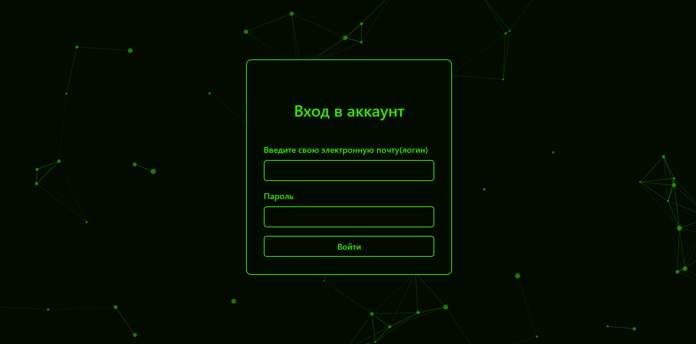
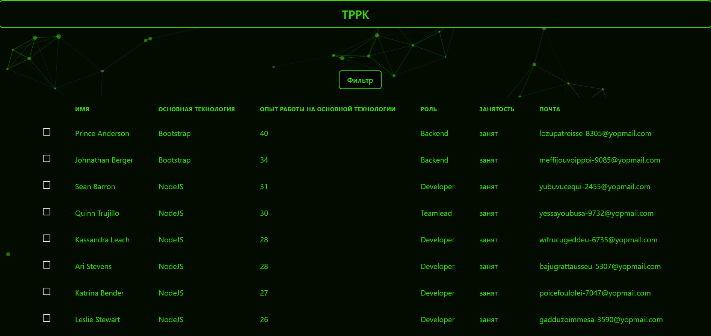
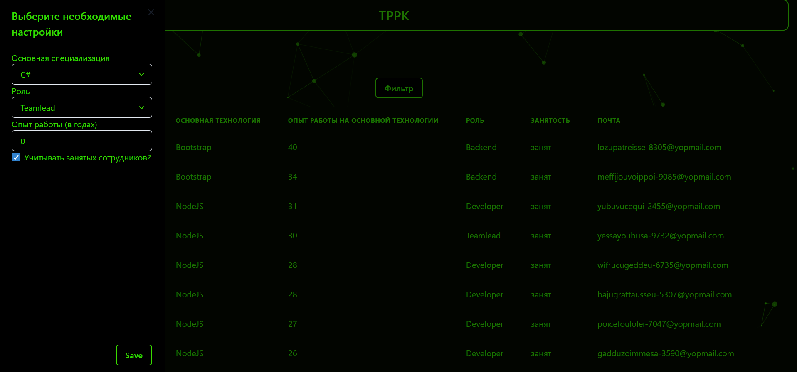
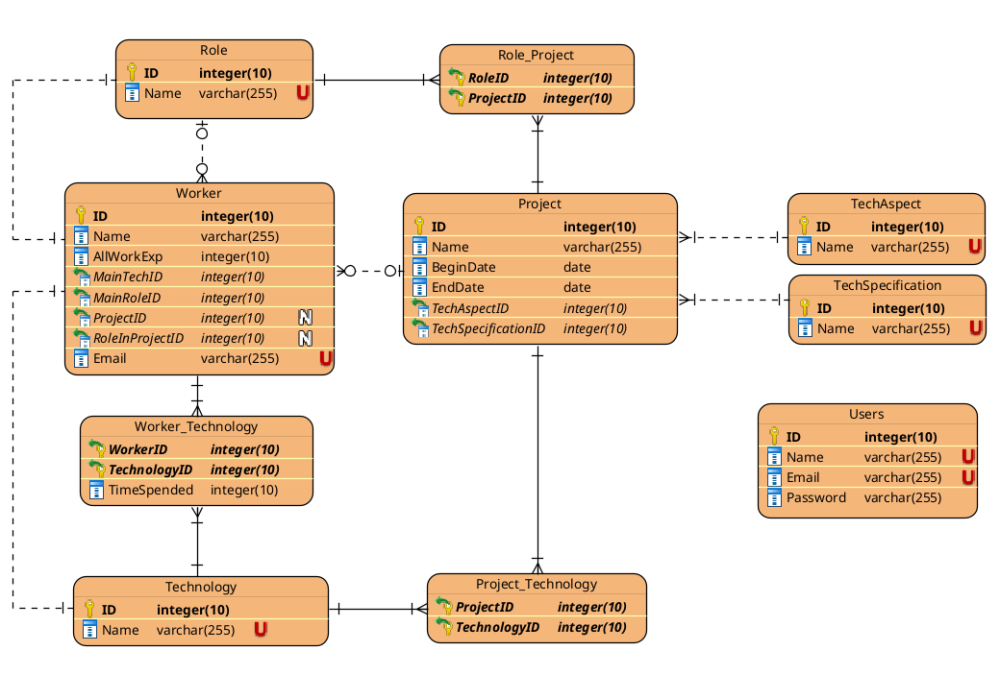

Трекер развития разработчиков в компании(ТРРК) - это API, позволяющий ускорить процесс выбора кадров для предстоящих задач, применяя различные фильтры.

При заходе, сайт встречает окном авторизации для менеджеров.

После ввода логина и пароля появляется сама таблица с сотрудниками, а также кнопка фильтров.

Нажатие на кнопку вызывает меню фильтров, в котором мы выбираем основную технологию и роль в разработке, вписываем минимальный стаж и допускаем занятность сотрудника в данный момент.

Используемые технологии в проекте:

Chakra UI

React-JS

postgreSQL

Вид сайта:

Доп. материал:

ER-диаграмма базы данных:

